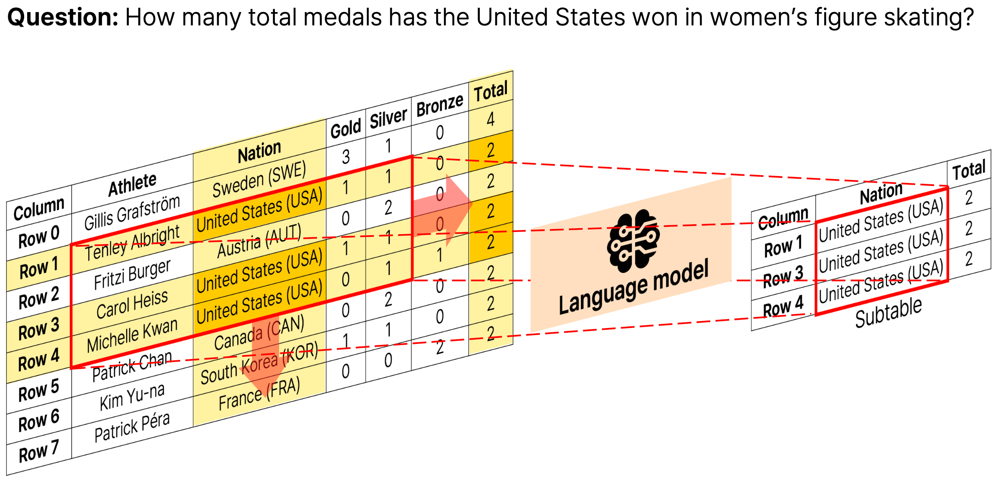

# Piece of Table: A Divide-and-Conquer Approach for Selecting Subtables in Table Question Answering<br>[ACL 2026]

[Paper](https://arxiv.org/abs/2412.07629) | [arXiv](https://arxiv.org/abs/2412.07629) | [Citation](#citation)

> Official repository for **"Piece of Table: A Divide-and-Conquer Approach for Selecting Subtables in Table Question Answering"**.

## Overview

Overview of the proposed *PieTa* (Piece of Table) framework. Given an input table and a question, it synthesizes a subtable by iteratively dividing the table into smaller windows, selecting relevant cells within each window using language models, and merging the resulting subwindows. This process is repeated until the final subtable is formed.

<p align="center">
  
</p>
    
## Abstract

Applying language models (LMs) to tables is challenging due to the mismatch between the two-dimensional structure of tables and the one-dimensional inputs expected by LMs. This mismatch forces linearization, making LMs particularly sensitive to irrelevant cells. Subtable selection mitigates this challenge by isolating question-relevant content prior to answer generation. However, existing approaches either rely on independent row or column selection, failing to capture cross-row and cross-column dependencies, or attempt global reasoning and face challenges similar to holistic table QA under noisy contexts. We propose *PieTa* (Piece of Table), a divide-and-conquer subtable selection framework that progressively aggregates locally selected evidence without requiring explicit global reasoning. *PieTa* uses an iterative, window-based multi-resolution process to construct compact subtables that capture global dependencies while limiting LM exposure to irrelevant content. Extensive experiments demonstrate that *PieTa* consistently outperforms prior subtable-based and holistic table QA approaches.

## Code

Code coming soon.

## Citation

If you find this work useful, please consider citing:

```bibtex
@Inproceedings{lee2024piece,
  title={Piece of {T}able: A Divide-and-Conquer Approach for Selecting Subtables in Table Question Answering},
  author={Lee, Wonjin and Kim, Kyumin and Lee, Sungjae and Lee, Jihun and Kim, Kwang In},
  booktitle={ACL},
  year={2026}
}
